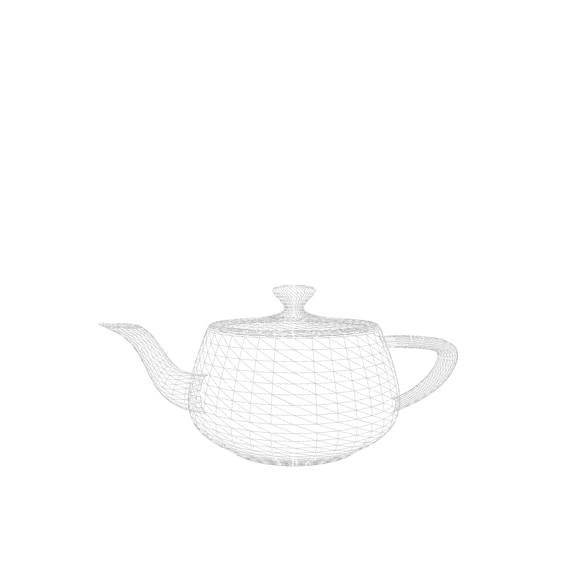

# renderer

This repo contains code for a software-only renderer. This is a hobby project and can't be used for anything serious. Performance-wise, it is slow compared to GPU renderers. For instance, it takes 1.2s, including model loading time, on my machine to render [Lucy](https://graphics.stanford.edu/data/3Dscanrep/), the render in the last row, which has 14,027,872 vertices and 28,055,742 triangles.

To run it: `make run && open output.png`
 
Here are some renders:

| Shaded                                 | Wireframe                                                  |
| -------------------------------------- | ---------------------------------------------------------- |
|         |         |
|  |  |
|   |   |
|             |             |
